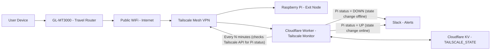

[] 
[] [] []

# Cloudflare Worker: Tailscale Device Monitor

Monitor Tailscale device status (e.g., RPi exit node) every 15 minutes. Get Slack alerts on offline/online changes. Free tier, serverless.

## Overview



**What it does**:
- Checks Tailscale API for device (e.g., `raspberrypi`)
- Compares vs last state in Cloudflare KV
- Alerts Slack only on changes (OFFLINE → ONLINE)

## Prerequisites
- Tailscale account with RPi device
- Slack workspace
- Free Cloudflare account
- Node.js + npm (dev machine)

## Setup

### 1. Tailscale OAuth Client (Read-Only)

1. Open **Tailscale Admin Console** in your browser:
    - Go to `https://login.tailscale.com/admin`.
2. Go to **Settings → Trust credentials**:
    - Left sidebar: click **Settings**.
    - Under Settings, choose **Trust credentials**.
3. Click **New credential** (or similar button).
4. Choose **OAuth** as the credential type.
5. On the OAuth configuration screen:
    - When asked **All Reads vs Custom scopes**, select **Custom scopes**.
    - Under **devices**, expand it and choose:
        - Check **core**.
        - Make sure permission is **Read** (not Write).
    - Leave other sections (posture attributes, routes, device invites, ACL, DNS, etc.) **unchecked**.
6. Create the OAuth credential.
    - Tailscale will show two important values:
        - **Client ID**
        - **Client secret**
    - Copy and save both somewhere secure; the **Client secret may only be shown once**.

You now have:

- `TAILSCALE_CLIENT_ID`  → Tailscale OAuth **Client ID**
- `TAILSCALE_CLIENT_SECRET` → Tailscale OAuth **Client secret**

### 2. Slack Webhook

1. Go to **Slack API Apps**:
    - Visit `https://api.slack.com/apps`.
2. Click **Create New App** → **From scratch**.
3. App name and workspace:
    - Give it a name (e.g., `Tailscale Monitor`).
    - Choose your workspace.
4. In the left menu, go to **Incoming Webhooks**.
5. Turn **Incoming Webhooks** ON.
6. Click **Add New Webhook to Workspace**.
    - Choose the channel where you want alerts (e.g., `#alerts`).
    - Click **Allow**.
7. Copy the generated **Webhook URL**, which looks like:
`https://hooks.slack.com/services/XXX/YYY/ZZZ`.

You now have:

- `SLACK_WEBHOOK_URL` → that full Slack webhook URL.

(Optional) Quick test from your machine:

```bash
curl -X POST -H "Content-Type: application/json" \
  --data '{"text":"Tailscale monitor test from terminal"}' \
  https://hooks.slack.com/services/XXX/YYY/ZZZ
```

You should see the test message in Slack.

### 3. Cloudflare Setup

1. Go to `https://dash.cloudflare.com/sign-up`.
2. Create an account with your email/password.
3. You do not need to add a website/domain just to use Workers.

### 4. Install Wrangler (Cloudflare CLI)

On your dev machine:

1. Install Wrangler globally:
```bash
npm install -g wrangler
```

2. Log in to Cloudflare:
```bash
wrangler login
```

- A browser window opens; log in with your Cloudflare account.
- After approval, Wrangler is authorized to manage Workers in your account.

### 5. Create Worker project (TypeScript)

1. Make a working folder and run `wrangler init`:
```bash
mkdir tailscale-monitor
cd tailscale-monitor
wrangler init
```

Wrangler will prompt:

- **Directory**: confirm `./tailscale-monitor` (or accept default).
- **What would you like to start with?**
    - Choose: **Hello World example**.
- **Use TypeScript?**
    - Choose: **Yes** (you did).
- **Use git?**
    - Optional: **Yes** or **No**.
- **Do you want to deploy?**
    - Choose: **No** for now (you’ll deploy after configuration).

2. Enter the generated project folder if Wrangler created a nested one:
```bash
cd tailscale-monitor  # if tailscale-monitor/tailscale-monitor exists
ls
```

You should see:

- `wrangler.jsonc`
- `src/index.ts`
- `package.json`, etc.

***

## 6. Configure wrangler.jsonc

Open `wrangler.jsonc` and ensure it looks like this:

```jsonc
{
  "name": "tailscale-monitor",
  "triggers": {
    "crons": ["*/15 * * * *"]
  },
  "kv_namespaces": [
    {
      "binding": "TAILSCALE_STATE",
      "id": "xxx"
    }
  ]
  ...
}
```

Notes:

- `crons` → `"*/15 * * * *"` = run every 15 minutes.
- The `kv_namespaces.id` will be filled in the next step; if you’re starting fresh, you can temporarily leave `"id": ""` and let Wrangler add it.

## 7. Configure KV namespace (TAILSCALE_STATE)

From inside the project folder (where `wrangler.jsonc` lives):

```bash
wrangler kv namespace create TAILSCALE_STATE
```

You'll see output similar to this:

```text
Creating namespace with title "TAILSCALE_STATE"
Success!
{
  "kv_namespaces": [
    {
      "binding": "TAILSCALE_STATE",
      "id": "xxx"
    }
  ]
}
✔ Would you like Wrangler to add it on your behalf? … yes
✔ What binding name would you like to use? … TAILSCALE_STATE
? For local dev, do you want to connect to the remote resource instead of a local resource? › (y/N)
```

- Answer **yes** when asked to add it to your config.
- When prompted “For local dev…”, choose **N** (No).

This updates `wrangler.jsonc` automatically with the correct `id`.

## 8. Put the monitoring code into src/index.ts (TypeScript)

Open `src/index.ts` and updated `EXIT_NODE_NAME` to match your Pi's hostname.

```ts
const EXIT_NODE_NAME = "raspberrypi";

```

Important:

- Set `EXIT_NODE_NAME` to match the Pi’s **hostname in Tailscale**, e.g. `"raspberrypi"` or `"pi5"`.

## 9. Add the Tailscale and Slack secrets to the Worker

From the project directory:

1. Set the Tailscale OAuth Client ID:
```bash
wrangler secret put TAILSCALE_CLIENT_ID
```

- When prompted `Enter a secret value:`, paste the **Client ID** from your Tailscale OAuth credential. 
- If it says “There doesn’t seem to be a Worker called ‘tailscale-monitor’… create one?” answer **Y** once.

2. Set the Tailscale OAuth Client Secret:
```bash
wrangler secret put TAILSCALE_CLIENT_SECRET
```

- Paste the **Client secret** from your Tailscale OAuth credential.

3. Set the Slack webhook:
```bash
wrangler secret put SLACK_WEBHOOK_URL
```

- Paste the Slack Incoming Webhook URL.

Each of these is stored securely by Cloudflare and made available as `env.TAILSCALE_CLIENT_ID`, etc.

***

## 10. Deploy the Worker

From the same folder:

```bash
wrangler deploy
```

You should see output similar to this:

- Upload size
- Binding info for `TAILSCALE_STATE` KV
- Deployed triggers with schedule `*/15 * * * *` 

Because you set `"workers_dev": false`, you won’t rely on the public `.workers.dev` URL — your Worker just runs on schedule.

## 11. Verification

### A. Tail logs

Run:

```bash
wrangler tail
```

Then wait for the next 15-minute tick. Watch for:

- No errors → normal checks.
- Slack alert messages when the Pi goes offline or comes back. 

### B. Functional test

1. Ensure Pi is online in Tailscale → no alerts for a couple of runs.
2. Power off or disconnect the Pi → next run should send:
    - `🚨 Tailscale exit node '...' went OFFLINE`
3. Power Pi back on → after it reconnects, next run should send:
    - `✅ Tailscale exit node '...' is back ONLINE`

Cloudflare + Tailscale + Slack monitoring is fully set up!

## Acknowledgements
- [Tailscale OAuth](https://tailscale.com/kb/1215/oauth-clients/) [dev](https://dev.to/sloan/should-i-have-separate-github-accounts-for-personal-and-professional-projects-3icl)
- [Cloudflare Wrangler](https://developers.cloudflare.com/workers/wrangler/) [stackoverflow](https://stackoverflow.com/questions/897586/does-git-publicly-expose-my-e-mail-address)
- [Slack Webhooks](https://api.slack.com/messaging/webhooks)

---