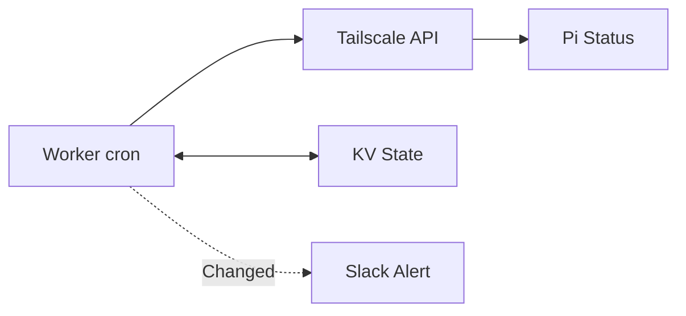

[] [] []

# Cloudflare Worker: Tailscale Monitor

**Free Slack alerts when your RPi exit node goes offline/online. Runs every 15min.**

## What It Does



## Prerequisites
- Tailscale account + RPi device
- Slack workspace
- Free Cloudflare account
- Node.js/npm (dev machine)

## 1-Click Setup

### 1. Tailscale OAuth (Read-Only)
```
Admin Console → Settings → Trust credentials → OAuth
Scopes: devices:core (Read)
Save: CLIENT_ID, CLIENT_SECRET
```

### 2. Slack Webhook
```
api.slack.com/apps → New App → Incoming Webhooks → #alerts
Copy WEBHOOK_URL
```

### 3. Deploy
```bash
npm i -g wrangler && wrangler login
mkdir monitor && cd monitor && wrangler init --typescript
# Edit wrangler.jsonc: crons */15, KV namespace
wrangler kv namespace create "TAILSCALE_STATE"
# Update src/index.ts: EXIT_NODE_NAME = "raspberrypi"
wrangler secret put TAILSCALE_CLIENT_ID
wrangler secret put TAILSCALE_CLIENT_SECRET
wrangler secret put SLACK_WEBHOOK_URL
wrangler deploy
```

### 4. Test
```bash
wrangler tail  # Watch logs
# Pi off → OFFLINE alert
# Pi on → ONLINE alert
```

## Customize
```
EXIT_NODE_NAME = "your-pi-hostname"  # src/index.ts
*/15 * * * * → Change cron frequency
```

## Troubleshooting
| Error | Fix |
|-------|-----|
| OAuth fail | `devices:core` read-only |
| No alerts | Check hostname match, `wrangler tail` |
| KV missing | `wrangler kv namespace list` |

## Full Code & Sources
Repo contains complete `src/index.ts` with:
- OAuth token refresh
- `connectedToControl` + `lastSeen` checks
- State change logic only

[MIT License](LICENSE.md) • [Issues](https://github.com/natonet-labs/tailscale-pi-exit-node/issues)

---