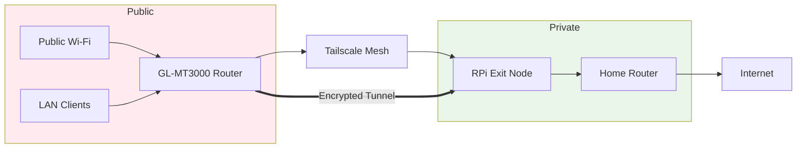

[]
[]
[]

# Secure Public Wi-Fi: GL-MT3000 + Raspberry Pi Exit Node

Create a travel VPN: GL-MT3000 (subnet router) forwards LAN devices (laptops/iPads) through home Raspberry Pi exit node. No Tailscale app needed on clients.

## Overview



## Quick Start

```bash
# On Pi
curl -fsSL https://tailscale.com/install.sh | sh
sudo tailscale up --advertise-exit-node
# Tailscale Admin: approve exit node

#GL-MT3000:
# 1. Enable Tailscale app + login
# 2. Manual DNS: 8.8.8.8
# 3. SSH: tailscale up --advertise-routes=192.168.8.0/24
# 4. LuCI Firewall: add tailscale0 to WAN zone
# 5. Tailscale Admin: approve 192.168.8.0/24 route
# 6. Tailscale app: Custom Exit Node → Pi IP
```

**What it does**:

Flow of network traffic when you are at a hotel:

- Hotel Wi-Fi → GL-MT300 WAN (Repeater mode).
- Your work laptop → GL-MT300 Wi-Fi/LAN (gets IP like `192.168.8.x`).
- GL-MT300 → Tailscale → Raspberry Pi at home (exit node).
- Raspberry Pi → Internet.

The hotel only sees encrypted Tailscale traffic; browsing appears to come from your home IP.

## Prerequisites

- Raspberry Pi (4B/5) at home, running Linux and online.
- GL.iNet GL‑MT3000 (firmware 4.x+).
- Tailscale account.
- SSH access to both Pi and GL-MT300.

## Pi Setup

### Install Tailscale

On the Pi:

```bash
curl -fsSL https://tailscale.com/install.sh | sh
```

### Enable IP forwarding on the Pi

```bash
echo 'net.ipv4.ip_forward = 1' | sudo tee -a /etc/sysctl.d/99-tailscale.conf
echo 'net.ipv6.conf.all.forwarding = 1' | sudo tee -a /etc/sysctl.d/99-tailscale.conf
sudo sysctl -p /etc/sysctl.d/99-tailscale.conf
```

This allows the Pi to actually route traffic for other devices.

### Bring up Tailscale with exit node

On the Pi:

```bash
sudo tailscale up --advertise-exit-node --accept-routes
```

In the Tailscale Admin Console:

- Go to **Machines**.
- Find the Pi (for example, `raspberrypi`).
- Click the **three dots → Edit route settings**.
- Check **Use as exit node**.

Verify from another device (e.g., laptop with Tailscale app) that selecting the Pi as exit node works and internet browsing is fine.

## Setup of GL‑MT3000 as Tailscale Client + Subnet Router

### Connect GL-MT300 to your home network

At home, connect:

- GL-MT300 WAN to your home router or
- GL-MT300 as Wi-Fi repeater to your home Wi-Fi.

Then open `http://192.168.8.1` in a browser and log into the GL.iNet admin UI.

### Enable Tailscale on GL-MT300

- In GL.iNet UI, go to **Applications → Tailscale**.
- Enable Tailscale.
- Bind/login to your Tailscale account.
- Make sure **Allow Remote Access LAN** is enabled while testing connectivity.

In the Tailscale Admin Console, you should now see a new device like `gl-mt3000` with a 100.x.x.x address.

### Set manual DNS on GL-MT300

This avoids DNS breakage when exit nodes are used.

- In GL.iNet UI, go to **Network → DNS**.
- Set **Mode: Manual**.
- Set DNS servers:
    - DNS Server 1: `8.8.8.8` (Google).
    - DNS Server 2 (optional): `1.1.1.1` (Cloudflare).
- Leave **DNS Rebinding Attack Protection** off for this setup if it causes issues.
- You can keep "Override DNS Settings of All Clients" and "Allow Custom DNS to Override VPN DNS" enabled so the manual DNS applies consistently when the VPN is active.

This ensures the router and LAN clients use known-good public DNS.

## Advertise Subnet

The GL-MT300 must publish its LAN (default `192.168.8.0/24`) into the tailnet so that LAN devices behind it can be routed through the tunnel.

### Advertise routes from GL-MT300

SSH into the GL-MT300:

```bash
ssh root@192.168.8.1
```

Then run:

```bash
tailscale up --advertise-routes=192.168.8.0/24 --accept-routes --accept-dns=false
```

- `--advertise-routes=192.168.8.0/24` tells Tailscale that GL-MT300 can route this subnet.
- `--accept-routes` lets it accept any routes from other nodes.
- `--accept-dns=false` prevents Tailscale from overriding your manual DNS.

Note: If "Allow Remote Access WAN" is selected, the GL.iNet script may also internally build an extra aggregate route, such as `192.168.4.0/22` that you'll see later in the router settings console.

### Approve routes in the Tailscale Admin Console

- Go to **Machines** in Tailscale Admin Console.
- Find **gl‑mt3000**.
- Click **three dots → Edit route settings**.
- You'll likely see:
    - `192.168.8.0/24`
    - Possibly `192.168.4.0/22` (a supernet derived from its configs).
- **Enable/approve only the route you actually need**:
    - Keep `192.168.8.0/24` checked.
    - **Uncheck** `192.168.4.0/22` unless you intentionally want that broader range.

This keeps routing clean and avoids exporting unnecessary internal ranges.

## Firewall Fix (LuCI)

By default, GL.iNet's Tailscale integration does not route LAN client traffic through exit nodes correctly; only the router itself can use the exit node. The fix is to teach the firewall that `tailscale0` belongs to the WAN side.

### Open LuCI

- In GL.iNet UI, go to **System → Advanced Settings → Go to LuCI** (OpenWrt).
- Log in with the same router password.

### Add `tailscale0` to WAN zone "covered devices"

- In LuCI, navigate to **Network → Firewall**.
- You should see three default zones listed roughly as:
    - `lan → wan`
    - `wan → REJECT`
    - `guest → wan`
- Click **Edit** on the second one (`wan → REJECT`).
- Go to the **Advanced Settings** tab.
- Find **Covered Devices** (or similar dropdown).
- Add/select **`tailscale0`** as a covered device.
- Click **Save**, then **Save \& Apply**.

This effectively says: "Treat the Tailscale interface like part of the WAN zone," allowing routing between LAN and Tailscale → WAN.

### Reboot the router

Do a full reboot so all firewall and Tailscale settings reload cleanly:

- In GL.iNet UI: **System → Reboot**, or
- Via SSH:

```bash
reboot
```

After the reboot, Tailscale should auto-start (from the GL.iNet app) and the firewall will have the updated zone mapping.

## Custom Exit Node

- The Pi is a working exit node.
- The GL-MT300 advertises `192.168.8.0/24`.
- The GL-MT300 firewall knows `tailscale0` belongs in the WAN zone.

You can tell the GL-MT300 to send all its traffic and LAN clients' traffic through the Pi.

### Select the Pi as Custom Exit Node

- In GL.iNet UI, go to **Applications → Tailscale**.
- Ensure Tailscale is **Enabled** (green).
- Look for **Custom Exit Node**:
    - Turn it **ON**.
    - Click the **refresh** icon next to the dropdown.
    - Select your **Raspberry Pi's Tailscale IP** (`100.10.10.100` in your case).
    - Click **Apply**.

You may see a warning like:

> "If you enable Custom Exit Node, the device will forward all requests to the Exit Node. Before enabling, you must enable subnet routes 192.168.8.0/24 of this device in Tailscale Admin Console."

You already did this in section **Advertise routes from GL-MT300**, and so this requirement is already satisfied.

### Verify Setup

| Test | Expected |
|------|----------|
| Router: `ping 8.8.8.8` | Succeeds |
| Client: icanhazip.com | **Home IP** |
| Client: google.com | Loads normally |

**Router (SSH into GL-MT300):**
```bash
ping -c 3 8.8.8.8
curl -I https://google.com
```

**LAN Client:**
- Connect to GL-MT300 Wi-Fi
- https://icanhazip.com → home IP
- Browse google.com → works normally

Optionally, if you have a ping app or terminal on the client:

- Ping the Pi Tailscale IP, e.g.,`100.10.10.100`.
- Ping the GL-MT300 Tailscale IPP, e.g.,`100.10.10.101`.
- Ping a public IP like `8.8.8.8`.

All should succeed.

## Travel Workflow

When you're on the road:

- Power the Pi at home and ensure it's online and visible in Tailscale.
- At the hotel, power the GL-MT300 and connect to:
    - Hotel Wi-Fi using Repeater mode in GL.iNet's Internet page.
- Confirm the GL-MT300 has internet (check from its admin UI).
- Ensure Tailscale is enabled on the GL-MT300 and Custom Exit Node is set to the Pi.
- Connect your work laptop / iPad / iPhone to the GL-MT300 Wi-Fi.

All traffic from your device now behaves as:

`Device → GL-MT3000 → Tailscale VPN Mesh → Raspberry Pi → Internet`.

Your traffic is encrypted across the public network, and sites see your home IP.

## Troubleshooting

In the Tailscale Admin Console under the GL-MT300's route settings you saw:

- `192.168.8.0/24`
- `192.168.4.0/22`

The `192.168.4.0/22` route is an **aggregate supernet** generated by GL.iNet's logic that covers several internal ranges (192.168.4.x–192.168.7.x).

For your travel use case:

- You only need `192.168.8.0/24` to cover the GL-MT300 LAN.
- It is best to **uncheck/disable** `192.168.4.0/22` in the Tailscale route settings for the GL-MT300 to avoid exporting extra, unused ranges.

This does not break anything in your working setup; it simply keeps routing clearer.

## Acknowledgements
- [Tailscale Subnets](https://tailscale.com/kb/1406/subnets)
- [GL.iNet Tailscale](https://docs.gl-inet.com/router/en/4/interface_guide/tailscale/)
- [Forum Fixes](https://forum.gl-inet.com/t/mt3000-tailscale-custom-exit-node/35528)

---