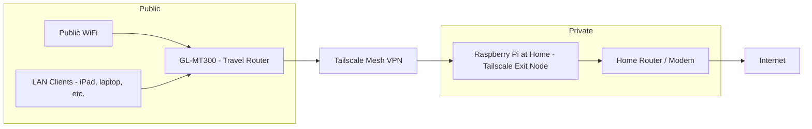

[] [] [] 

# Secure Public WiFi with GL‑MT3000 + Raspberry Pi (Tailscale Exit Node)

Secure public WiFi: GL-MT300 as Tailscale subnet router → RPi home exit node. LAN devices (laptops/iPads) get encrypted tunnel without Tailscale install.

## Overview



**What it does**:

Flow of network traffic when you are at a hotel:

1. Hotel WiFi → GL-MT300 WAN (Repeater mode).
2. Your work laptop → GL-MT300 WiFi/LAN (gets IP like `192.168.8.x`).
3. GL-MT300 → Tailscale → Raspberry Pi at home (exit node).
4. Raspberry Pi → Internet.

The hotel only sees encrypted Tailscale traffic; browsing appears to come from your home IP.

## Prerequisites

- Raspberry Pi (4B/5) at home, running Linux and online.
- GL.iNet GL‑MT3000 (firmware 4.x+).
- Tailscale account.
- SSH access to both Pi and GL-MT300.

## Setup

### 1. Install Tailscale

On the Pi:

```bash
curl -fsSL https://tailscale.com/install.sh | sh
```

### 2. Enable IP forwarding on the Pi

```bash
echo 'net.ipv4.ip_forward = 1' | sudo tee -a /etc/sysctl.d/99-tailscale.conf
echo 'net.ipv6.conf.all.forwarding = 1' | sudo tee -a /etc/sysctl.d/99-tailscale.conf
sudo sysctl -p /etc/sysctl.d/99-tailscale.conf
```

This allows the Pi to actually route traffic for other devices.

### 3. Bring up Tailscale with exit node

On the Pi:

```bash
sudo tailscale up --advertise-exit-node --accept-routes
```

In the **Tailscale Admin Console**:

1. Go to **Machines**.
2. Find the Pi (for example, `raspberrypi`).
3. Click the **three dots → Edit route settings**.
4. Check **Use as exit node**.

Verify from another device (e.g., laptop with Tailscale app) that selecting the Pi as exit node works and internet browsing is fine.

## 4. Setup of GL‑MT3000 as Tailscale Client + Subnet Router

### 4.1. Connect GL-MT300 to your home network

At home, connect:

- GL-MT300 WAN to your home router **or**
- GL-MT300 as WiFi repeater to your home WiFi.

Then open `http://192.168.8.1` in a browser and log into the GL.iNet admin UI.

### 4.2. Enable Tailscale on GL-MT300

1. In GL.iNet UI, go to **Applications → Tailscale**.
2. **Enable** Tailscale.
3. Bind/login to your Tailscale account.
4. Make sure **Allow Remote Access LAN** is enabled while testing connectivity.

In the Tailscale Admin Console, you should now see a new device like `gl-mt3000` with a 100.x.x.x address.

### 4.3. Set manual DNS on GL-MT300

This avoids DNS breakage when exit nodes are used.

1. In GL.iNet UI, go to **Network → DNS**.
2. Set **Mode: Manual**.
3. Set DNS servers:
    - DNS Server 1: `8.8.8.8` (Google).
    - DNS Server 2 (optional): `1.1.1.1` (Cloudflare).
4. Leave **DNS Rebinding Attack Protection** off for this setup if it causes issues.
5. You can keep "Override DNS Settings of All Clients" and "Allow Custom DNS to Override VPN DNS" **on** so the manual DNS applies consistently when the VPN is active.

This ensures the router and LAN clients use known-good public DNS.

## 5. Advertise the GL-MT300 LAN Subnet via Tailscale

The GL-MT300 must publish its LAN (default `192.168.8.0/24`) into the tailnet so that LAN devices behind it can be routed through the tunnel.

### 5.1. Advertise routes from GL-MT300

SSH into the GL-MT300:

```bash
ssh root@192.168.8.1
```

Then run:

```bash
tailscale up --advertise-routes=192.168.8.0/24 --accept-routes --accept-dns=false
```

- `--advertise-routes=192.168.8.0/24` tells Tailscale that GL-MT300 can route this subnet.
- `--accept-routes` lets it accept any routes from other nodes.
- `--accept-dns=false` prevents Tailscale from overriding your manual DNS.

Note: If "Allow Remote Access WAN" is selected, the GL.iNet script may also internally build an extra aggregate route, such as `192.168.4.0/22` that you'll see later in the router settings console.

### 5.2. Approve routes in the Tailscale Admin Console

1. Go to **Machines** in Tailscale Admin Console.
2. Find **gl‑mt3000**.
3. Click **three dots → Edit route settings**.
4. You'll likely see:
    - `192.168.8.0/24`
    - Possibly `192.168.4.0/22` (a supernet derived from its configs).
5. **Enable/approve only the route you actually need**:
    - Keep `192.168.8.0/24` checked.
    - **Uncheck** `192.168.4.0/22` unless you intentionally want that broader range.

This keeps routing clean and avoids exporting unnecessary internal ranges.

## 6. Critical Firewall Adjustment in LuCI (WAN zone covers Tailscale)

By default, GL.iNet's Tailscale integration does **not** route LAN client traffic through exit nodes correctly; only the router itself can use the exit node. The fix is to teach the firewall that `tailscale0` belongs to the WAN side.

### 6.1 Open LuCI

1. In GL.iNet UI, go to **System → Advanced Settings → Go to LuCI** (OpenWrt).
2. Log in with the same router password.

### 6.2 Add `tailscale0` to WAN zone "covered devices"

1. In LuCI, navigate to **Network → Firewall**.
2. You should see three default zones listed roughly as:
    - `lan → wan`
    - `wan → REJECT`
    - `guest → wan`
3. Click **Edit** on the second one (`wan → REJECT`).
4. Go to the **Advanced Settings** tab.
5. Find **Covered Devices** (or similar dropdown).
6. Add/select **`tailscale0`** as a covered device.
7. Click **Save**, then **Save \& Apply**.

This effectively says: "Treat the Tailscale interface like part of the WAN zone," allowing routing between LAN and Tailscale → WAN.

### 6.3 Reboot the router

Do a full reboot so all firewall and Tailscale settings reload cleanly:

- In GL.iNet UI: **System → Reboot**, or
- Via SSH:

```bash
reboot
```

After the reboot, Tailscale should auto-start (from the GL.iNet app) and the firewall will have the updated zone mapping.

## 7. Enable Custom Exit Node to Use the Pi

- The Pi is a working exit node.
- The GL-MT300 advertises `192.168.8.0/24`.
- The GL-MT300 firewall knows `tailscale0` belongs in the WAN zone.

You can tell the GL-MT300 to send **all its traffic and LAN clients' traffic** through the Pi.

### 7.1 Select the Pi as Custom Exit Node

1. In GL.iNet UI, go to **Applications → Tailscale**.
2. Ensure Tailscale is **Enabled** (green).
3. Look for **Custom Exit Node**:
    - Turn it **ON**.
    - Click the **refresh** icon next to the dropdown.
    - Select your **Raspberry Pi's Tailscale IP** (`100.10.10.100` in your case).
    - Click **Apply**.

You may see a warning like:

> "If you enable Custom Exit Node, the device will forward all requests to the Exit Node. Before enabling, you must enable subnet routes 192.168.8.0/24 of this device in Tailscale Admin Console…"

You already did this in section 5.2, and so this requirement is already satisfied.

## 8. Testing the Setup

### 8.1. Basic connectivity from GL-MT300

SSH into the GL-MT300 again (after Custom Exit Node is enabled) and test:

```bash
ping -c 3 8.8.8.8
curl -I https://google.com
```

If these work, the router itself is successfully using the Pi exit node.

### 8.2. Test from a LAN client (laptop / iPad / iPhone)

1. Connect your iPad or laptop to the GL-MT300 WiFi (not directly to hotel or home WiFi).
2. Visit `https://icanhazip.com` or `https://ifconfig.io` in a browser.
3. Confirm the reported public IP matches your **home** IP (where the Pi lives), not the hotel network.[^2]
4. Open websites normally (e.g., google.com). They should work.

Optionally, if you have a ping app or terminal on the client:

- Ping the Pi Tailscale IP, e.g.,`100.10.10.100`.
- Ping the GL-MT300 Tailscale IPP, e.g.,`100.10.10.101`.
- Ping a public IP like `8.8.8.8`.

All should succeed.

## 9. Notes on the 192.168.4.0/22 Supernet

In the Tailscale Admin Console under the GL-MT300's route settings you saw:

- `192.168.8.0/24`
- `192.168.4.0/22`

The `192.168.4.0/22` route is an **aggregate supernet** generated by GL.iNet's logic that covers several internal ranges (192.168.4.x–192.168.7.x).

For your travel use case:

- **You only need `192.168.8.0/24`** to cover the GL-MT300 LAN.
- It is best to **uncheck/disable** `192.168.4.0/22` in the Tailscale route settings for the GL-MT300 to avoid exporting extra, unused ranges.

This does not break anything in your working setup; it simply keeps routing clearer.

## 10. What to Do When Traveling (Hotel / Airbnb)

When you're on the road:

1. Power the Pi at home and ensure it's online and visible in Tailscale.
2. At the hotel, power the GL-MT300 and connect to:
    - Hotel WiFi using Repeater mode in GL.iNet's Internet page.
3. Confirm the GL-MT300 has internet (check from its admin UI).
4. Ensure Tailscale is enabled on the GL-MT300 and Custom Exit Node is set to the Pi.
5. Connect your work laptop / iPad / iPhone to the GL-MT300 WiFi.

All traffic from your device now behaves as:

`Device → GL-MT3000 → Tailscale VPN Mesh → Raspberry Pi → Internet`.

Your traffic is encrypted across the public network, and sites see your home IP.

## Acknowledgements:

- [Tailscale Subnet](https://tailscale.com/kb/1406/subnets)
- [GL.iNet Tailscale](https://docs.gl-inet.com/router/en/4/interface_guide/tailscale/)
- [Forum Fixes](https://forum.gl-inet.com/t/mt3000-tailscale-custom-exit-node/35528) 

---