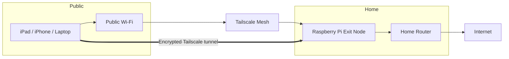

[]
[]
[]

# Secure Public Wi-Fi with Tailscale + Raspberry Pi Exit Node

Turn a Raspberry Pi at home into your own VPN exit node and route your device's traffic through it on public Wi-Fi.



## Quick Start

For experienced users, here's the minimal set of commands:

```bash
# On Pi
curl -fsSL https://tailscale.com/install.sh | sh
sudo tailscale up --advertise-exit-node

# In Admin Console:
# 1. Approve Pi
# 2. Enable "Use as exit node"
# On Your Device:
# 1. Install Tailscale
# 2. Connect → select Pi as Exit Node
```

## Who Is It For?

Anyone who wants a simple, personal VPN using their own hardware instead of renting a VPS or buying a commercial VPN. Ideal for securing hotel, café, and airport Wi-Fi on iOS devices.

## What Tailscale Is and Why Use It

### What Tailscale Does

- Creates a private, encrypted mesh network ("tailnet") between your devices.
- Uses WireGuard under the hood, but handles NAT traversal, keys, and IP changes for you.
- Each device gets a 100.x.y.z address and can talk securely across the internet.

### What Is an Exit Node?

- An exit node is a special device in your tailnet that can send traffic out to the public internet on behalf of other devices.
- When your device uses the Pi as an exit node, all your internet traffic (web browsing, apps, etc.) is encrypted to the Pi, then goes out from your home network.
- This is similar to a commercial VPN, but you control the server (the Pi at home).

### Security Benefits for Travel

Using your Pi exit node while on public Wi-Fi:

- The local network only sees encrypted Tailscale packets, not which sites you visit.
- Attackers on the same Wi-Fi can't sniff or tamper with your traffic easily.
- Sites you visit see your home IP, which can help with region-restricted content and reduces some fraud triggers.

## Setup Overview

You will:

1. Create a Tailscale account.
2. Install and configure Tailscale on a Raspberry Pi at home.
3. Enable the Pi as an exit node.
4. Install Tailscale on your iOS device (e.g., iPhone, iPad).
5. Tell your device to use the Pi as the exit node.
6. (Optional) Tune DNS and MagicDNS for smoother use.

## Requirements

- Raspberry Pi (3B, 4B, 5, etc.)
  - Running Raspberry Pi OS or similar Linux.
  - Connected to your home router via Ethernet or Wi-Fi.
- Basic ability to SSH into the Pi, or attach keyboard/monitor.
- Any device running Tailscale (iPhone, iPad, Android, laptop, etc.).
- A Tailscale account (Google, Microsoft, GitHub, or email login).

## Set Up Tailscale on the Raspberry Pi

### Install Tailscale

```bash
curl -fsSL https://tailscale.com/install.sh | sh
```

### Start Tailscale and connect the Pi to your tailnet

```bash
sudo tailscale up
```

This will print a URL, for example:

> To authenticate, visit: https://login.tailscale.com/a/XXXXXXX

1. Open that URL in a browser (on any device).
2. Log into Tailscale.
3. Approve the Pi to join your tailnet.

Once done, execute:

```bash
sudo tailscale status
```

You should see the Pi listed with a Tailscale IP like `100.x.y.z`.

## Enable the Raspberry Pi as an Exit Node

### Turn on IP forwarding on the Pi

```bash
# Enable IP forwarding so the Pi can route traffic
echo 'net.ipv4.ip_forward = 1' | sudo tee -a /etc/sysctl.d/99-tailscale.conf
echo 'net.ipv6.conf.all.forwarding = 1' | sudo tee -a /etc/sysctl.d/99-tailscale.conf
sudo sysctl -p /etc/sysctl.d/99-tailscale.conf
```

This changes system settings so Linux is allowed to forward packets between interfaces.

### Advertise the Pi as an exit node

```bash
sudo tailscale up --advertise-exit-node
```

- `--advertise-exit-node` tells Tailscale "this device is willing to route other devices internet traffic."
- You may add `--accept-routes` if you also want the Pi to accept subnet routes from other devices, but for basic use it's optional.

### Approve the Pi as exit node in the Tailscale Admin Console

For security, you must explicitly allow the Pi to serve as an exit node for your tailnet.

- Visit the Tailscale Admin Console in a browser: https://login.tailscale.com/admin/machines
- Find your Pi in the list. It should have an "Exit Node" badge or be marked as offering an exit node.
- Click the three dots (…) at the right → Edit route settings.
- Check the box Use as exit node.
- Click Save.
- (Recommended) In that same menu, disable key expiry for the Pi so it doesn't stop working while you're traveling.

Now the Pi is ready to be used by other devices as an exit node.

## Install Tailscale on Your Device

### Get the Tailscale App

- **iOS/iPadOS**: App Store → search "Tailscale"
- **Android**: Play Store → search "Tailscale" 
- **Desktop**: Download from [tailscale.com/download](https://tailscale.com/download)

Open the app once installed.

### Log into Tailscale on Your Device

1. Open the Tailscale app.
2. Tap Log in.
3. Use the same account you used for the Pi (Google/Microsoft/GitHub/email).
4. Approve the device in the Tailscale Admin Console if prompted.

Once logged in, the app will show your tailnet and list of available devices (including the Pi).

## Use the Raspberry Pi as Exit Node

### Enable Tailscale VPN on Your Device

1. In the Tailscale app, ensure it shows "Connected" or enable the switch to connect.
2. The first time, you will need to allow VPN configuration. Tap Allow.

### Select the Pi as the exit node

In the Tailscale app:

1. Open the main screen of the app.
2. Look for an option called Exit Node (may be under a menu or settings icon).
3. Tap Exit Node.
4. You should see your Raspberry Pi listed (using its hostname, such as `raspberrypi`, and sometimes an "Exit node" tag).
5. Select the Raspberry Pi as the exit node.
6. Optionally, toggle "Allow local network access" if you want to still reach devices on the local Wi-Fi while using the exit node.

Now all traffic goes like this:

> Your device → Encrypted Tailscale tunnel → Raspberry Pi at home → Internet.

## Verify That the Exit Node Is Working

### Check your outward IP address

On the device, with Tailscale connected and the Pi selected as the exit node:

- Open Safari or another browser.
- Visit a site that shows your public IP, such as:
    - https://icanhazip.com
    - https://ifconfig.io
- Compare this IP to the IP you see when using Wi-Fi directly at home (not via Tailscale).

If the exit node is working, the IP address should match your home IP (or your home router's ISP IP), not the hotel or coffee shop IP.

### Test basic browsing

- While on a public Wi-Fi, try visiting normal websites (google.com, news sites, etc.).
- If they load quickly and behave normally, your traffic is flowing through the Pi.

If your device can browse normally when the exit node is off, but fails when it's on, revisit:

- Whether IP forwarding is enabled on the Pi.
- Whether the Pi still shows as an exit node in the admin console.
- Whether the Pi itself has a working internet connection (try `ping 8.8.8.8` on the Pi).

## DNS and MagicDNS (Optional but Helpful)

### What is MagicDNS?

- MagicDNS lets you reach devices in your tailnet by name (like `raspberrypi.tailnet-name.ts.net`) instead of IP addresses.
- It also handles DNS resolution of your tailnet names via a special DNS server `100.100.100.100`.

### Enable or adjust MagicDNS

In the Tailscale Admin Console:

- Go to the DNS section.
- Ensure MagicDNS is enabled if you want easy name-based access to your devices.
- You can optionally set global DNS servers (e.g., Cloudflare `1.1.1.1`, Google `8.8.8.8`).

On your device, Tailscale will often configure DNS automatically to use its DNS resolver for tailnet domains while still resolving the public internet correctly.

### Troubleshooting DNS

If:

- You can reach IP addresses (like `8.8.8.8`) but not domain names (like `google.com`), then it's a DNS problem.
- Check the DNS page in the Tailscale console:
    - Ensure you've set a valid upstream DNS (e.g., `1.1.1.1` or `8.8.8.8`).
    - Toggle MagicDNS off/on and reconnect the clients to force a refresh.

## Everyday Usage Pattern When Traveling

When you’re on hotel or café Wi-Fi:

- Connect your iOS device to the local Wi-Fi.
- Open Tailscale and connect.
- Select your Raspberry Pi as the exit node.
- Visit https://icanhazip.com and confirm it shows your home IP.
- Browse normally; all traffic now goes through your Pi at home.

To stop using the tunnel, disable the exit node or disconnect Tailscale; your device goes back to using the local ISP directly.

## Security and Maintenance Tips

- Keep the Pi updated:

```bash
sudo apt update && sudo apt upgrade
```

This applies security patches to the OS and packages.
- Keep Tailscale updated occasionally by rerunning the install script or using your package manager.
- Protect the Pi physically:
It's now a key part of your secure connectivity; keep it plugged into a reliable router/UPS if possible.
- Use strong account security on your Tailscale login (e.g., 2FA on your Google/GitHub account) because controlling that account effectively controls access to your tailnet.

## Acknowledgements

- [Tailscale Exit Nodes](https://tailscale.com/kb/1103/exit-nodes)
- [FreeCodeCamp: Tailscale on Raspberry Pi](https://www.freecodecamp.org/news/set-up-a-home-vpn-using-tailscale-on-a-raspberry-pi/)
- [MagicDNS](https://education.raspberrypiaustralia.online/network-manager/magicdns)


---