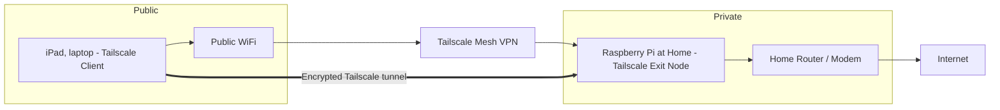

# Secure Public WiFi with Tailscale + Raspberry Pi Exit Node



This guide shows how to:

- Turn a **Raspberry Pi at home** into a secure **Tailscale exit node** (like your own VPN server).
- Use the **Tailscale app on your iPad** to send all internet traffic through that Pi, so that:
    - Public WiFi (hotel, coffee shop, airport) only sees encrypted Tailscale traffic.
    - Websites see your **home IP address**, not the hotel’s.

No prior networking experience is assumed.

***

## 1. What Tailscale Is and Why Use It

### 1.1 What Tailscale does

- Tailscale creates a **private, encrypted mesh network** between your devices, called a **tailnet**.[^1]
- It uses the **WireGuard** protocol under the hood, but handles all the hard parts (NAT traversal, keys, IP changes) for you.[^2] [^3]
- Each device gets a private IP address like `100.x.y.z` and can securely talk to other devices in your tailnet, even across the internet.[^1]


### 1.2 What is an exit node?

- An **exit node** is a special device in your tailnet that can send traffic **out to the public internet** on behalf of other devices.[^4] [^1]
- When your iPad uses the Pi as an exit node, **all** your iPad’s internet traffic (web browsing, apps, etc.) is encrypted to the Pi, then goes out from your home network.
- This is similar to a commercial VPN, but **you** control the server (the Pi at home).[^5]


### 1.3 Security benefits for travel

Using your Pi exit node while on hotel/airport WiFi:

- The local network only sees **encrypted Tailscale packets**, not which sites you visit.[^4]
- Attackers on the same WiFi can’t sniff or tamper with your traffic easily.
- Sites you visit see your **home IP**, which can help with region-restricted content and reduces some fraud triggers.[^6] [^3]

***

## 2. Setup Overview

You will:

1. Create a **Tailscale account**.
2. Install and configure Tailscale on a **Raspberry Pi at home**.
3. Enable the Pi as an **exit node**.
4. Install Tailscale on your **iPad**.
5. Tell the iPad to **use the Pi as the exit node**.
6. (Optional) Tune DNS and MagicDNS for smoother use.

***

## 3. Requirements

- **Raspberry Pi** (3B, 4B, 5, etc.)
    - Running Raspberry Pi OS or similar Linux.
    - Connected to your home router via Ethernet or WiFi.
- Basic ability to **SSH** into the Pi, or attach keyboard/monitor.
- An **iPad** (iPadOS) with access to the App Store.
- A Tailscale account (Google, Microsoft, GitHub, or email login).[^1]

***

## 4. Set Up Tailscale on the Raspberry Pi

### 4.1 Install Tailscale

On your Pi (via SSH or terminal):

```bash
curl -fsSL https://tailscale.com/install.sh | sh
```

This script detects your Linux distro and installs the correct Tailscale package.[^2]

If it fails, run:

```bash
cat /etc/os-release
```

Then follow distro-specific instructions from Tailscale docs for manual install.[^2]

### 4.2 Start Tailscale and connect the Pi to your tailnet

On the Pi:

```bash
sudo tailscale up
```

This will print a URL, for example:

> To authenticate, visit: https://login.tailscale.com/a/XXXXXXX

1. Open that URL in a browser (on any device).
2. Log into Tailscale.
3. Approve the Pi to join your tailnet.[^2]

After this, run:

```bash
sudo tailscale status
```

You should see the Pi listed with a Tailscale IP like `100.x.y.z`.[^2]

***

## 5. Enable the Raspberry Pi as an Exit Node

### 5.1 Turn on IP forwarding on the Pi

To allow the Pi to route traffic for other devices, enable IP forwarding:

```bash
echo 'net.ipv4.ip_forward = 1' | sudo tee -a /etc/sysctl.d/99-tailscale.conf
echo 'net.ipv6.conf.all.forwarding = 1' | sudo tee -a /etc/sysctl.d/99-tailscale.conf
sudo sysctl -p /etc/sysctl.d/99-tailscale.conf
```

This changes system settings so Linux is allowed to forward packets between interfaces.[^7] [^2]

### 5.2 Advertise the Pi as an exit node

On the Pi:

```bash
sudo tailscale up --advertise-exit-node
```

- `--advertise-exit-node` tells Tailscale “this device is willing to route other devices’ internet traffic.”[^7] [^2]
- You may add `--accept-routes` if you also want the Pi to accept subnet routes from other devices, but for basic use it’s optional.[^1]


### 5.3 Approve the Pi as exit node in the Tailscale Admin Console

For security, you must explicitly allow the Pi to serve as an exit node for your tailnet.[^8] [^1]

1. Visit the **Tailscale Admin Console** in a browser:
https://login.tailscale.com/admin/machines
2. Find your Pi in the list. It should have an **“Exit Node”** badge or be marked as offering an exit node.[^7]
3. Click the **three dots** (…) at the right → **Edit route settings**.
4. Check the box **Use as exit node**.
5. Click **Save**.[^7] [^1]
6. (Recommended) In that same menu, **disable key expiry** for the Pi so it doesn’t stop working while you’re traveling.[^3]

Now the Pi is ready to be used by other devices as an exit node.

***

## 6. Install Tailscale on the iPad

### 6.1 Get the Tailscale app from the App Store

On your iPad:

1. Open the **App Store**.
2. Search for **“Tailscale”**.
3. Download and install the Tailscale app.[^1]

### 6.2 Log into Tailscale on the iPad

1. Open the **Tailscale** app.
2. Tap **Log in**.
3. Use the same account you used for the Pi (Google/Microsoft/GitHub/email).[^1]
4. Approve the iPad in the Tailscale Admin Console if prompted.

Once logged in, the app will show your tailnet and list of available devices (including the Pi).

***

## 7. Use the Raspberry Pi as Exit Node on the iPad

### 7.1 Enable Tailscale VPN on the iPad

1. In the Tailscale app, ensure it shows **“Connected”** or enable the switch to connect.
2. The first time, iPadOS will ask you to **allow VPN configuration**. Tap **Allow**.
3. You might be prompted for your device passcode or Face ID/Touch ID.[^1]

### 7.2 Select the Pi as the exit node

In the Tailscale app on the iPad:

1. Open the main screen of the app.
2. Look for an option called **Exit Node** (may be under a menu or settings icon).[^4] [^1]
3. Tap **Exit Node**.
4. You should see your Raspberry Pi listed (using its hostname, such as `raspberrypi`, and sometimes an “Exit node” tag).
5. Select the **Raspberry Pi** as the exit node.
6. Optionally, toggle “Allow local network access” if you want to still reach devices on the local WiFi while using the exit node.[^4]

Now all traffic from your iPad goes:

> iPad → Encrypted Tailscale tunnel → Raspberry Pi at home → Internet.

***

## 8. Verify That the Exit Node Is Working

### 8.1 Check your outward IP address

On the iPad, with Tailscale connected and the Pi selected as the exit node:

1. Open Safari or another browser.
2. Visit a site that shows your public IP, such as:
    - https://icanhazip.com
    - https://ifconfig.io
3. Compare this IP to the IP you see when using WiFi directly at home (not via Tailscale).[^3]

If the exit node is working, the IP address should match your **home** IP (or your home router’s ISP IP), not the hotel or coffee shop IP.

### 8.2 Test basic browsing

- While on a foreign or hotel WiFi, try visiting normal websites (google.com, news sites, etc.).
- If they load quickly and behave normally, your traffic is flowing through the Pi.

If the iPad can browse normally when the exit node is off, but **fails** when it’s on, revisit:

- Whether IP forwarding is enabled on the Pi.
- Whether the Pi still shows as an exit node in the admin console.
- Whether the Pi itself has a working internet connection (try `ping 8.8.8.8` on the Pi).[^2]

***

## 9. DNS and MagicDNS (Optional but Helpful)

### 9.1 What is MagicDNS?

- MagicDNS lets you reach devices in your tailnet by **name** (like `raspberrypi.tailnet-name.ts.net`) instead of IP addresses.[^9] [^10]
- It also handles DNS resolution of your tailnet names via a special DNS server `100.100.100.100`.[^10] [^9]


### 9.2 Enable or adjust MagicDNS

In the Tailscale Admin Console:

1. Go to the **DNS** section.
2. Ensure **MagicDNS** is enabled if you want easy name-based access to your devices.[^10]
3. You can optionally set **global DNS servers** (e.g., Cloudflare `1.1.1.1`, Google `8.8.8.8`).[^11]

On iOS/iPadOS, Tailscale will often configure DNS automatically to use its DNS resolver for tailnet domains while still resolving the public internet correctly.[^11]

### 9.3 Troubleshooting DNS

If:

- You can reach IP addresses (like `8.8.8.8`) but **not domain names** (like `google.com`), then it’s a DNS problem.
- Check the DNS page in the Tailscale console:
    - Ensure you’ve set a valid upstream DNS (e.g., `1.1.1.1` or `8.8.8.8`).[^11]
    - Toggle MagicDNS off/on and reconnect the clients to force a refresh.

***

## 10. Everyday Usage Pattern When Traveling

When you go to a hotel or coffee shop:

1. Connect your **iPad** to the local WiFi like normal.
2. Open the **Tailscale** app on the iPad.
3. Ensure Tailscale shows **Connected**.
4. In the Exit Node settings, select your **Raspberry Pi**.
5. Confirm a site like https://icanhazip.com shows your home IP.
6. Use the internet normally; all traffic is now going through your Pi at home.

When you no longer need the secure tunnel:

- Open Tailscale, turn **off** the exit node selection or disconnect Tailscale.
- Your iPad will return to using the local ISP directly.

***

## 11. Security and Maintenance Tips

- **Keep the Pi updated**:

```bash
sudo apt update && sudo apt upgrade
```

This applies security patches to the OS and packages.
- **Keep Tailscale updated** occasionally by rerunning the install script or using your package manager.[^7] [^2]
- **Protect the Pi physically**:
It’s now a key part of your secure connectivity; keep it plugged into a reliable router/UPS if possible.
- **Use strong account security** on your Tailscale login (e.g., 2FA on your Google/GitHub account) because controlling that account effectively controls access to your tailnet.[^1]

***

Sources:

[^1]: https://tailscale.com/kb/1103/exit-nodes

[^2]: https://www.freecodecamp.org/news/set-up-a-home-vpn-using-tailscale-on-a-raspberry-pi/

[^3]: https://thewirednomad.com

[^4]: https://tailscale.com/kb/1408/quick-guide-exit-nodes

[^5]: https://www.reddit.com/r/Tailscale/comments/1bszpqg/what_is_an_exit_node_and_do_i_need_one/

[^6]: https://www.reddit.com/r/Tailscale/comments/1ictz2e/using_exit_node_when_travelling_is_this_concept/

[^7]: https://johnnyfivepi.github.io/tailscale-on-raspberry-pi/

[^8]: https://docs.raspap.com/features-insiders/tailscale/

[^9]: https://deepwiki.com/tailscale/tailscale/7.1-dns-resolver-and-magicdns

[^10]: https://education.raspberrypiaustralia.online/network-manager/magicdns

[^11]: https://github.com/tailscale/tailscale/issues/13927

[^12]: https://www.reddit.com/r/Tailscale/comments/17f5tp3/raspberry_pi_as_exit_node/

[^13]: https://github.com/johnnyfivepi/tailscale-on-raspberry-pi

[^14]: https://github.com/johnnyfivepi/tailscale-on-raspberry-pi/blob/main/README.md

[^15]: https://community.umbrel.com/t/make-tailscale-use-exit-node/11229

[^16]: https://www.reddit.com/r/CasaOS/comments/1gwsz82/how_do_i_setup_my_server_as_a_tailscale_exit_node/

